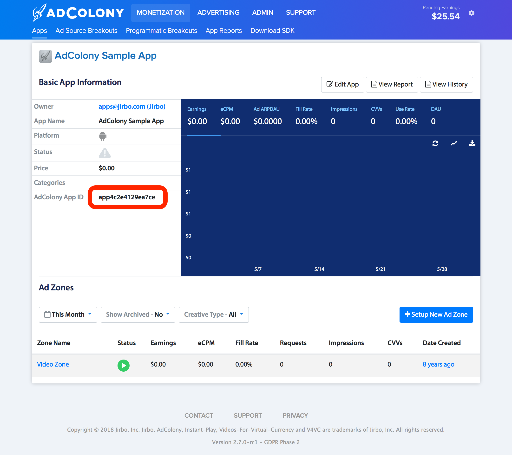
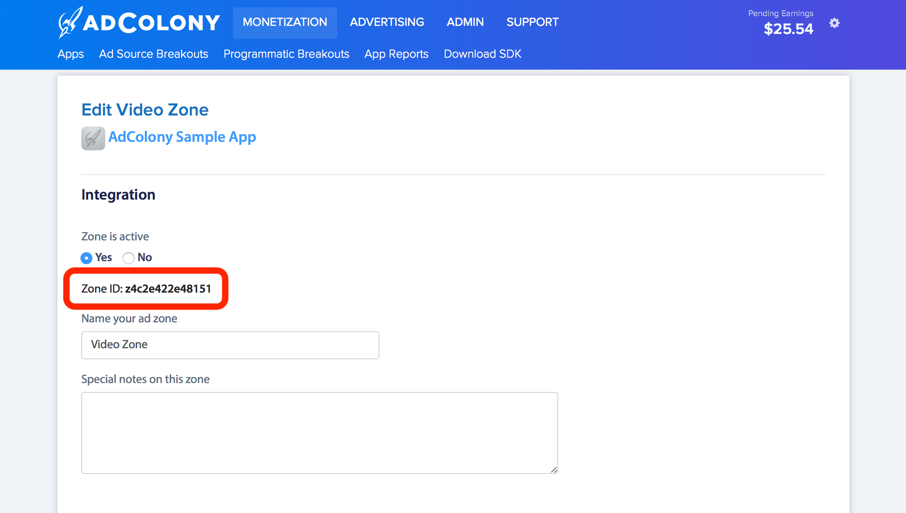
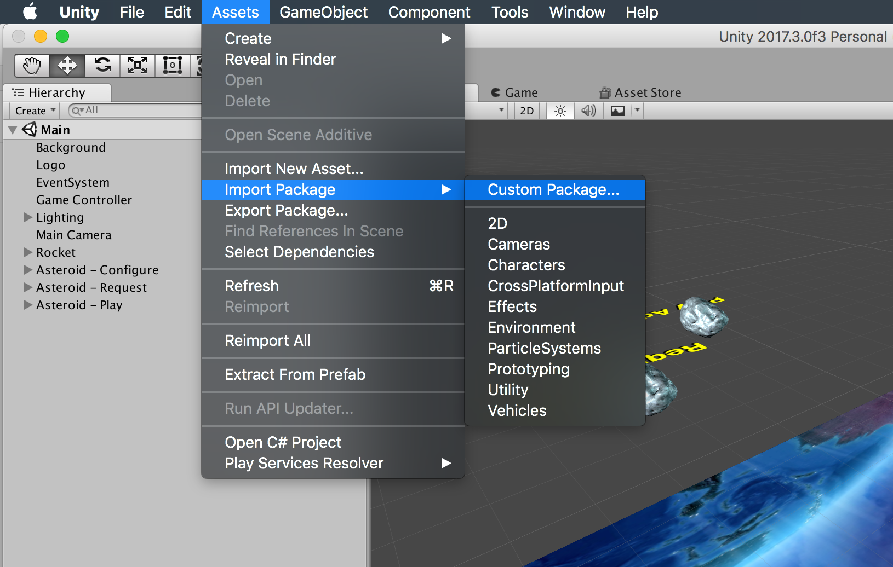
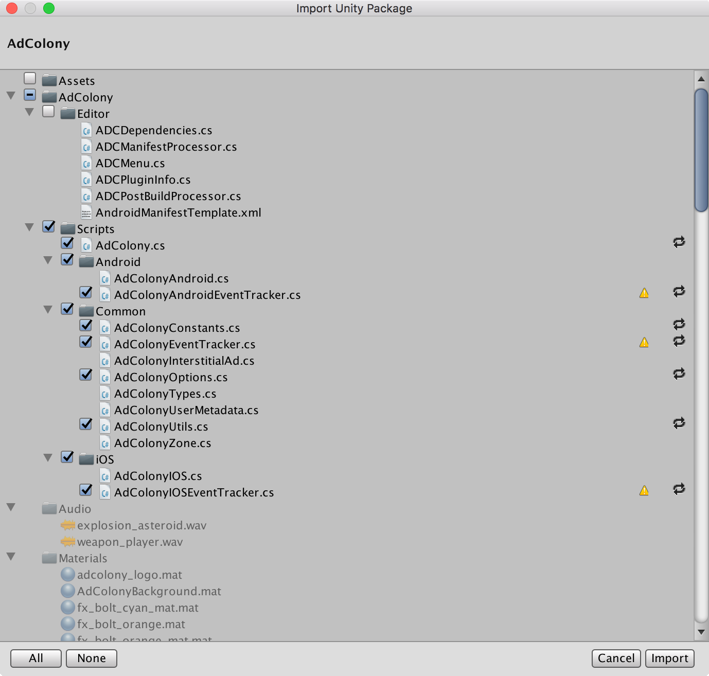
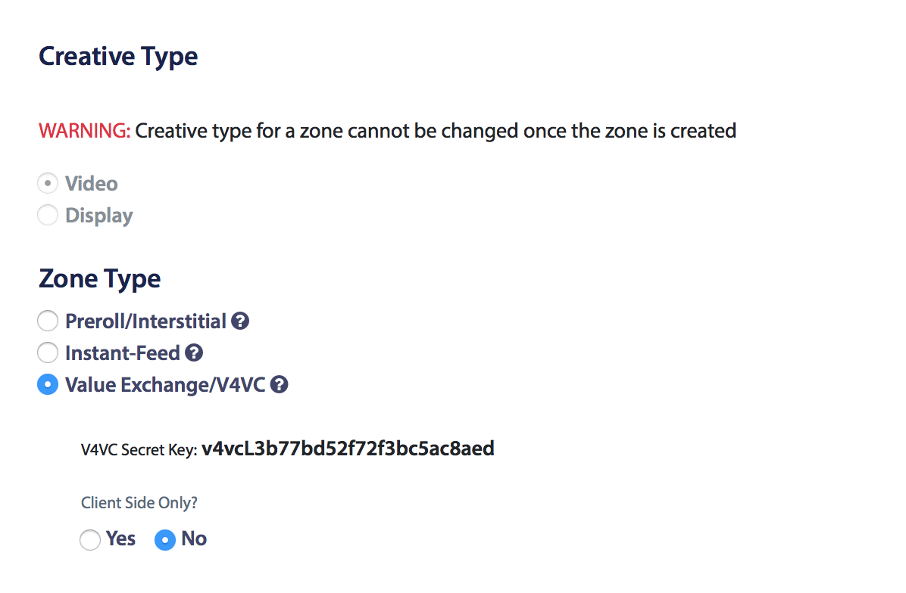

<br>


*Updated July 6, 2018*

# AdColony SDK Unity Plugin
- [Requirements](#requirements)
- [Overview](#overview)
- [Release Notes](#release-notes)
- [How to Build](#how-to-build)
- [Getting Started](#getting-started)
    - [Retrieve AdColony App and Zone Ids](#retrieve-adColony-app-and-zone-ids)
    - [Installation](#installation)
    - [Showing Ads](#showing-ads)
    - [Rewarded Video Ads](#rewarded-video-ads)
- [Gradle Integration](#gradle-integration)
- [GDPR](#gdpr)
- [Legal Requirements](#legal-requirements)
- [Contact Us](#contact-us)
- [License](#license)

# Requirements
- Mac OS *(feel free to add Windows support and make a pull request!)*
- [Unity 5.x+](https://unity3d.com/get-unity/download)
- [Android SDK](https://developer.android.com/studio/#downloads)

# Overview
AdColony delivers zero-buffering, [full-screen Instant-Play™ HD video](https://www.adcolony.com/technology/instant-play/), [interactive Aurora™ Video](https://www.adcolony.com/technology/auroravideo), and Aurora™ Playable ads that can be displayed anywhere within your application. Our advertising SDK is trusted by the world’s top gaming and non-gaming publishers, delivering them the highest monetization opportunities from brand and performance advertisers. AdColony’s SDK can monetize a wide range of ad formats including in-stream/pre-roll, out-stream/interstitial and V4VC™, a secure system for rewarding users of your app with virtual currency upon the completion of video and playable ads.

# Release Notes
## v3.3.5

* Officially open sourced Unity plugin
* Updated to AdColony SDK 3.3.5 (iOS/Android)
* Several bug fixes and stability improvements.
* [iOS] Removed requirement for the camera and calendar permissions. However, with these permissions enabled, you may be able to receive higher paying ads.
* [Android] Fixed RejectedExecutionException in issue [#37](https://github.com/AdColony/AdColony-Android-SDK-3/issues/37).
* [Android] Made Android SDK changes needed to fix the Unity OnConfigurationCompleted callback issue in [#35](https://github.com/AdColony/AdColony-Unity-SDK-3/issues/35).

## v3.3.4

* Updated to AdColony SDK 3.3.4 (iOS/Android)
* [iOS] Fixed a bug where advertisement video's close button was not easily tappable because of the status bar overlapping.
* [iOS] Fixed a bug where unsafe access to the device's battery level was causing a crash mentioned in [iOS SDK issue #49](https://github.com/AdColony/AdColony-iOS-SDK-3/issues/49).
* [Android] Fixed new NullPointerException mentioned in [Android SDK issue #29](https://github.com/AdColony/AdColony-Android-SDK-3/issues/29#issuecomment-381380548).
* [Unity] Added a new API to pass user consent as required for compliance with the European Union's General Data Protection Regulation (GDPR). If you are collecting consent from your users, you can make use of this new API to inform AdColony and all downstream consumers of the consent. Please see our GDPR FAQ for more information and our GDPR wiki for implementation details.
* [Unity] Removed symbolic links from within native SDK
* [Unity] Fixed missing zone ID in some log statements
* [Unity] Fixed exception during OnRequestInterstitialFailed callback mentioned in [Unity Plugin issue #42](https://github.com/AdColony/AdColony-Unity-SDK-3/issues/42)
* [All] Several bug fixes and stability improvements.

See the full [release notes](https://github.com/AdColony/AdColony-Unity-SDK-3/blob/master/CHANGELOG.md) for more details.

# How to Build

The Unity plugin requires both the native iOS and Android SDK repositories in the `Plugin/src/sdks` directory. You can pull them down using the following commands:

```
cd Plugin/src/sdks
git clone https://github.com/AdColony/AdColony-Android-SDK-3.git
git clone https://github.com/AdColony/AdColony-iOS-SDK-3.git
```

To build the plugin, use the makefile from the Plugin folder:

```
cd Plugin
make
```

Included in this repository is a sample application you can use during your testing.

# Getting Started

## Retrieve AdColony App and Zone Ids

Log into [clients.adcolony.com](http://clients.adcolony.com/). If you have not already done so, create an app and needed zones on the website. To create new apps and video zones, locate the green buttons on the right-hand side of the Publisher section. Retrieve your **app ID** and your corresponding **zone IDs** from the AdColony website and make note of them for later use. Please reference the screenshots below on locations of the **app ID** and **zone IDs**.

<p align="center">
    
</p>

Click on the zone link at the bottom of the page to bring up the zone details.

<p align="center">
    
</p>

In this case, the app id, `app4c2e4129ea7ce`, and zone id, `z4c2e422e48151` should be used to initialize the app and display ads within your project.

## Installation

1. In the Unity Editor, select "Assets"->"Import Package"->"Custom Package". Navigate to the location of the AdColony SDK Unity Plugin and select "AdColony.unitypackage".

    <p align="center">
        
    </p>

2. Select "Import" to import all the assets into your project.

    <p align="center">
        
    </p>

3. The AdColony SDK Unity Plugin includes Google's PlayServicesResolver to automatically pull in necessary Google Play Services libraries. If there are conflicts with this, the `play-services-ads` library is the only required. You can choose to ignore this PlayServicesResolver installation, remove the `AdColony/Editor/ADCDependencies.cs` file, and include the `play-services-ads` in another way.
4. The Plugins/Android/AdColony/AndroidManifest.xml file is automatically generated. To update manually, select "Tools"->"AdColony"->"Update AndroidManifest.xml".

#### Upgrading from SDK 3.0.x:
In order to support thin/fat Android builds, we moved the native .so files from the `Plugins/Android/AdColony/libs` folder to the `Plugins/Android/libs` folder. Removing the `Plugins/Android/AdColony` folder before importing is recommended.

#### Upgrading from SDK 2.x:
Please note that updating from our 2.x Unity Plugin is not a drag and drop update, but rather includes breaking API and process changes. In order to take advantage of the 3.x Unity Plugin, please remove the older plugin before installing.

## Showing Ads

The basics of using the AdColony SDK to serve ads to your users are:
1. Configure the service

    The first step is to configure the AdColony SDK:
    ```csharp
    string[] zoneIds = new string[] { "zone_id_1", "zone_id_2" };
    AdColony.Ads.Configure(APP_ID, null, zoneIds);
    ```

    You can configure the service more than once without any performance impact. If the service is already initialized with the same options and zones, the attempt will be ignored.

    See the API documentation on how to use the `AppOptions`.

1. Register for callbacks

    At this point, you will also want to register for important service callbacks such as:

    * `OnRequestInterstitial` - Called when a requested ad is ready to be shown
    * `OnExpiring` - Called when an ad has expired (typically after 30-60 min), we suggest using this callback to request a new ad
    * `OnRewardGranted` - Called when user has completed a video from a rewarded video zone

    For a complete listing of callbacks see `AdColony.cs`.

    ```cs
    AdColony.InterstitialAd _ad = null;

    AdColony.Ads.OnRequestInterstitial += (AdColony.InterstitialAd ad) => {
        _ad = ad;
    };

    AdColony.Ads.OnExpiring += (AdColony.InterstitialAd ad) => {
        AdColony.Ads.RequestInterstitialAd(ad.ZoneId, null);
    };
    ```

1. Request an ad

    ```csharp
    AdColony.Ads.RequestInterstitialAd("zone_id_1", null);
    ```

1. Show the ad

    ```csharp
    if (_ad != null) {
        AdColony.Ads.ShowAd(_ad);
    }
    ```

## Rewarded Video Ads
Showing a rewarded video ad is very much like showing a video ad. There are two subtle differences:
1. You can optionally show system alerts informing the user they are about to or have received an award using the ad options `ShowPrePopup` and `ShowPostPopup`.
    ```csharp
    AdColony.AdOptions adOptions = new AdColony.AdOptions();
    adOptions.ShowPrePopup = true;
    adOptions.ShowPostPopup = true;

    AdColony.Ads.RequestInterstitialAd("zone_id_1", adOptions);
    ```

2. If the ad comes from a zone set as rewarded from the developer portal, the `OnRewardGranted` event will be called after the user watches the ad. Within this callback is when the reward should then be granted to the user. If you have enabled server-to-server callbacks, this is when you should download new state from your server.
    ```csharp
    AdColony.Ads.OnRewardGranted += (string zoneId, bool success, string name, int amount) => {
        // Grant the reward to the user, or
        // request new state from the game server if using server-to-server callbacks
    };
    ```

To set your zone to a rewarded interstitial zone on the portal, select the following zone type:

<p align="center">
    
</p>

# Gradle Integration

Unity introduced the Gradle build system for Android in Unity 5.5. This document outlines the setup required to use AdColony with Gradle in your Unity package.

Add the following to your build.gradle file:
```
android {
  /** Any other configurations here */
  sourceSets {
    main {
      jniLibs.srcDirs = ['libs']
    }
  }
}
```

If using Proguard, add the following to your Proguard configuration:
```
# For communication with AdColony's WebView
-keepclassmembers class * { 
    @android.webkit.JavascriptInterface <methods>; 
}

# Keep ADCNative class members unobfuscated
-keepclassmembers class com.adcolony.sdk.ADCNative** {
    *;
 }
```

Note: for more details on the AdColony Android setup, please refer to [AdColony Android Project Setup](https://github.com/AdColony/AdColony-Android-SDK-3/wiki/Project-Setup).

# GDPR

In compliance with the European Union's General Data Protection Regulation (GDPR), if you are collecting consent from your users, you can make use of APIs discussed below to inform AdColony and all downstream consumers of this information. Please see our [GDPR FAQ](https://www.adcolony.com/gdpr/) for more information.

### Passing Consent via AppOptions
In the AdColony SDK Unity plugin v3.3.4, we added explicit methods to our AppOptions API for GDPR compliance. You may use any combinations of these options. We require the GDPR consent string to have a value of "1" or "0". A value of "1" implies the user has given consent to store and process personal information and a value of "0" means the user has declined consent.

#### Example Code
```csharp
AdColony.AppOptions options = new AdColony.AppOptions();

// Indicates the GDPR requirement of the user. 
// If it's true, the user's subject to the GDPR laws. 
// If you set it to false, the value of consent string will be ignored.
options.GdprRequired = true; 

// Your user's consent string. 
// In this case, the user has given consent to store and process personal information.
options.GdprConsentString = "1"; 

AdColony.Ads.Configure(APP_ID, appOptions, ZONE_IDS);
```

# Legal Requirements
By downloading the AdColony SDK, you are granted a limited, non-commercial license to use and review the SDK solely for evaluation purposes.  If you wish to integrate the SDK into any commercial applications, you must register an account with AdColony and accept the terms and conditions on the AdColony website.

Note that U.S. based companies will need to complete the W-9 form and send it to us before publisher payments can be issued.

# Contact Us
For more information, please visit AdColony.com. For questions or assistance, please email us at support@adcolony.com.

# License
AdColony SDK Unity Plugin is available under the Apache 2.0 license. See the LICENSE file for more info.

<br>
<br>
<p align="center">
    Made with ❤️ in Seattle and Dallas
    <br>
    
</p>
